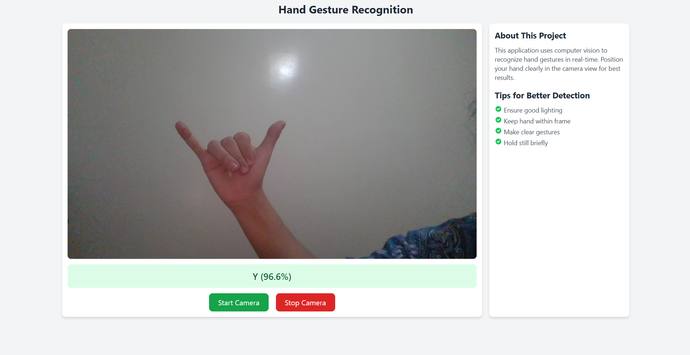

# Hand Gesture Recognition Flask App

  
*Screenshot of the app interface*

---

## Overview

This Flask web application performs hand gesture recognition from images using a deep learning model. It uses MediaPipe Hands for hand landmark detection combined with a TensorFlow model trained to classify hand gestures corresponding to letters A-Z plus a space gesture.

The app exposes a simple web interface and a REST API endpoint (`/predict`) that accepts images and returns predicted gestures with confidence scores.

---

## Features

- Hand detection and landmark extraction with MediaPipe
- Image preprocessing using CLAHE and normalization
- Dual-input TensorFlow model that uses cropped hand images and hand landmarks
- Flask REST API for gesture prediction from base64-encoded images
- HTTPS support via SSL certificates (optional)

---

## Installation

### Requirements

- Python 3.8 or higher  
- TensorFlow  
- OpenCV  
- MediaPipe  
- Flask  
- Pillow  
- NumPy

Install dependencies with:

```bash
pip install tensorflow opencv-python mediapipe flask pillow numpy ```

Install dependencies with:
